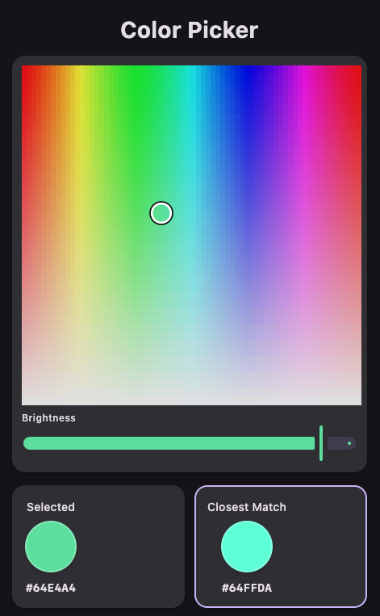

# KMP Color Picker

A **Kotlin Multiplatform** (Compose Multiplatform) color picker app that lets you select any color and instantly finds the **closest match** from a predefined palette.

<p align="center">
  
</p>

## How It Works

1. **Pick a color** using the HSV color panel (hue + saturation) and brightness slider
2. The app displays your **selected color** alongside the **closest palette match**
3. The matching color is highlighted in the palette grid with a checkmark

Color matching uses the **CIE L\*a\*b\*** color space with **Delta E (CIE76)** distance, which is far more perceptually accurate than simple RGB euclidean distance. This means the "closest" color actually looks closest to the human eye.

## Platforms

| Platform | Run command |
|----------|-------------|
| Desktop (JVM) | `./gradlew composeApp:run` |
| Android | `./gradlew composeApp:installDebug` |
| iOS | Open `iosApp` in Xcode |

## Color Palette

The app includes 64 curated colors spanning reds, pinks, purples, blues, cyans, teals, greens, limes, yellows, oranges, browns, greys, and blue greys.

## Tech Stack

- **Kotlin Multiplatform** with shared UI via Compose Multiplatform
- **Compose Material 3** for theming and components
- **CIE L\*a\*b\*** color space conversion (sRGB → XYZ → L\*a\*b\*) for perceptual color matching

## Project Structure

```
composeApp/src/
├── commonMain/          # Shared code (UI + logic)
│   └── kotlin/com/colorpicker/
│       ├── domain/      # ColorMatcher (L*a*b*), ColorPalette
│       └── ui/          # App screen, ColorPickerPanel
├── androidMain/         # Android entry point
├── desktopMain/         # Desktop (JVM) entry point
└── iosMain/             # iOS entry point
```

## Requirements

- JDK 17+
- Android SDK 35 (for Android target)
- Xcode (for iOS target)
